# Hi, I'm Malik Dixon 👋

### AI Workflow & Systems Builder | Secure AI Automation | AWS | DevSecOps | Cloud Security

I design and build trusted, measurable business workflows using AI, cloud infrastructure, automation, and security-first engineering.

My work focuses on turning AI from an isolated tool into an operational system—one that can be evaluated, governed, observed, and safely connected to business processes.

**Secure it. Automate it. Observe it. Scale it.**

---

## About Me

I am a U.S. Army veteran and technology professional with more than 25 years of experience learning, building, troubleshooting, and improving technical systems.

Today, I work at the intersection of:

- AI agents, RAG, MCP, and workflow automation
- AWS and Azure cloud architecture
- DevOps and DevSecOps delivery pipelines
- Agent identity, delegated authority, and runtime authorization
- Observability, evaluation, governance, and human oversight

I build systems that are secure, maintainable, observable, cost-aware, and designed for real operational use—not just demonstrations.

---

## Current Projects & Stages

| Project | Stage | Current Focus |
| --- | --- | --- |
| [**TraceLogicAI**](https://tracelogicai.com) | **Live Product · Active Development** | Comparing Plain, RAG, MCP, Agent, and Security-aware pipelines; evaluation scoring; trace evidence; remediation; runtime assurance; and agent permission/data-access governance. |
| **CatchRailAI** | **Working Beta · Validation** | A purchase-order and RFQ safety net that detects, classifies, extracts, verifies, escalates, and tracks exceptions with human approval and audit history. |
| **Agent Sandbox Runtime** | **Infrastructure Prototype** | Restricted AI-agent execution on AWS ECS Fargate using Terraform, Docker, network isolation, policy controls, observability, and an automated kill switch. Private build. |
| **SEIR** | **Architecture & Terraform Implementation** | A serverless AWS security orchestration and response platform using deterministic controls, EventBridge orchestration, WAF telemetry, Cognito, and Amazon Bedrock for explanation—not authorization. |
| **RevenuePilotAI** | **Functional Prototype** | A supervised multi-agent sales assistant with RAG, account research, deal analysis, outreach drafting, and approval-gated CRM updates. |
| **ListenDirect** | **Concept & Architecture Validation** | A low-latency speech-to-speech agent with streaming, interruption handling, barge-in, and OpenAI Realtime-compatible interfaces. |
| [**Project Sentinel**](https://github.com/mdixon47/project-sentinel-terraform) | **Completed · Maintained** | Event-driven AWS security detection, automated remediation, alerting, retry/DLQ handling, observability, and Terraform-based governance. |

### Next Project Track

**Secure Kubernetes Agent Platform — Planning**

A cloud-native platform for running AI and coding agents as governed workloads, with an AI gateway, MCP gateway, workload identity, end-to-end tracing, per-tool authorization, and isolated execution environments. AWS/EKS is the initial reference architecture, with Azure and GCP variants planned.

---

## What I Build

- Secure AI agents, RAG systems, and MCP-enabled workflows
- Evaluation pipelines and CI quality gates for AI applications
- Human-approved automation for high-impact business actions
- Cloud infrastructure with Terraform and CloudFormation
- CI/CD pipelines with SAST, DAST, SCA, secrets, container, and IaC scanning
- Agent identity, least-privilege permissions, and runtime policy enforcement
- Monitoring, logging, cost tracking, and operational dashboards
- Responsive applications, APIs, dashboards, and workflow tools

---

## Selected Completed Projects

### Operation Aegis — Docker-Driven DevSecOps Pipeline

Built a Docker-based security pipeline for a simulated fintech platform. GitHub Actions runs unit, integration, smoke, SAST, DAST, SCA, secrets, and infrastructure checks from pull request through staging validation.

**Stack:** Docker · GitHub Actions · DevSecOps · CI/CD · SAST · DAST · SCA  
**Repository:** [operation-aegis](https://github.com/mdixon47/operation-aegis)  
**Case study:** [How I Built a Docker-Tested DevSecOps Pipeline](https://mdixondev62.hashnode.dev/how-i-built-a-docker-tested-devsecops-pipeline-in-github-actions)

### AuditTrail SDK — AWS Compliance Auditor Without Static Keys

Built an AWS compliance auditing tool that inventories cloud resources, uses temporary credentials, records structured API evidence, and exposes findings through an API.

**Stack:** AWS · IAM · Terraform · Python · boto3 · GitHub Actions OIDC  
**Repository:** [audittrail-sdk](https://github.com/mdixon47/audittrail-sdk)  
**Case study:** [I Built an AWS Compliance Auditor That Uses No Static Keys](https://mdixondevsecops2.hashnode.dev/i-built-an-aws-compliance-auditor-that-uses-no-static-keys)

### Project Sentinel — Self-Healing Cloud Security Automation

Built a cloud-native system that detects AWS security events, performs controlled serverless remediation, and provides evidence through CloudTrail, EventBridge, Lambda, CloudWatch, SNS, X-Ray, retries, and dead-letter queues.

**Stack:** AWS · Terraform · Lambda · EventBridge · CloudTrail · CloudWatch · GitHub Actions  
**Repository:** [project-sentinel-terraform](https://github.com/mdixon47/project-sentinel-terraform)  
**Case study:** [Building a Self-Healing Cloud Security System](https://projectsentineldevsecops.hashnode.dev/project-sentinel-building-a-self-healing-cloud-security-system-a-dsb-cap)

### CloudMart — Secure Web Assets Pipeline

Expanded an S3 troubleshooting lab into a repeatable DevSecOps deployment pipeline with CloudFormation, GitHub Actions, security gates, post-deployment HTTP checks, and documented remediation evidence.

**Stack:** AWS S3 · CloudFormation · GitHub Actions · IAM · Checkov · Snyk · cfn-lint  
**Repository:** [aws-cloudmart-secure-web-assets](https://github.com/mdixon47/aws-cloudmart-secure-web-assets)  
**Case study:** [From S3 AccessDenied to DevSecOps](https://s3accessdeniedtodevsecops.hashnode.dev/from-s3-accessdenied-to-devsecops-building-the-cloudmart-secure-web-assets-pipeline)

---

## Technology Stack

### AI & Application Development

### Cloud, DevOps & Infrastructure

### Security & Assurance

---

## Engineering Principles

- **Deterministic controls for security decisions:** models may explain findings, but policy and authorization determine whether actions proceed.
- **Verify before execution:** identity, delegated authority, purpose, resource, context, and current permission must be checked before a tool call or state-changing action.
- **Human oversight based on reach:** higher-blast-radius actions require stronger approval, containment, and stop authority.
- **Evidence across the execution chain:** prompt → plan → tool call → command → system activity → result → verification.
- **Build–Verify–Destroy:** cloud labs are validated and then removed to control cost and reduce unnecessary exposure.

---

## Current Focus

- Turning AI into trusted, measurable business workflows
- Building evaluation, remediation, and governance systems for AI applications
- Securing agent tools, data access, delegated authority, and runtime execution
- Expanding production-style AWS, DevOps, and DevSecOps implementations
- Preparing for AWS AI Practitioner and AWS Developer Associate certifications

---

## GitHub Metrics

  
  

  
  

> Metrics are generated daily by GitHub Actions and stored in this repository.

---

## Community & Contributions

I contribute to **The DevSec Blueprint (DSB)** and continue building practical cloud security and DevSecOps projects through community-based learning and collaboration.

**Community repository:** [The DevSec Blueprint](https://github.com/devsecblueprint/devsecblueprint?tab=readme-ov-file)

---

## Connect With Me

- [LinkedIn](https://www.linkedin.com/in/malik-dixon/)
- [GitHub](https://github.com/mdixon47)
- [TraceLogicAI](https://tracelogicai.com)

---

### Turning AI into trusted, measurable business workflows.
